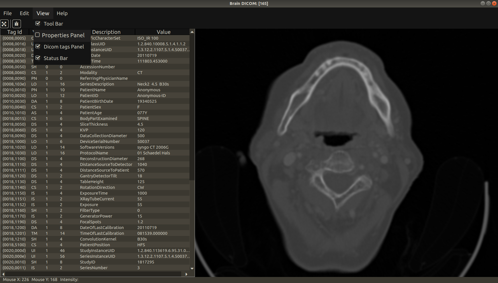

# BrainDICOM

*BrainDICOM* is Open Source DICOM Viewer writteln in C++, Qt5/QML, and DCMTK

*BrainDICOM* is under development.

## Getting Started

### Required Software
* Qt5/QML
* DCMTK
* Other

### Running

* Linux

* Windows

## Screens

## License

License information is in the file [License.md](License.md)

## Authors

* **Maksym Tymkovych** [on github](https://github.com/MaksymTymkovych)

